# Flowchart Sistem Absensi & Jadwal - Madani Al-Aziziyah

```mermaid
flowchart TB
    %% ===== USER ROLES =====
    subgraph Roles["Role Pengguna"]
        Admin["Admin"]
        Guru["Guru"]
        WaliMurid["Wali Murid"]
    end

    %% ===== MAIN ENTITIES =====
    subgraph MasterData["Master Data"]
        Classroom["Classroom\n(Kelas X/XI/XII)"]
        Subject["Subject\n(Mata Pelajaran)"]
        User["User\n(Akun Login)"]
        Student["Student\n(Siswa)"]
        TeacherSubject["TeacherSubject\n(Mapping Guru-Mapel-Kelas)"]
    end

    subgraph Operations["Operasional"]
        Schedule["Schedule\n(Jadwal Sore 14:00-16:00)"]
        Attendance["Attendance\n(Absensi H/S/I/A)"]
        ScoreComponent["ScoreComponent\n(Komponen & Bobot Nilai)"]
        Score["Score\n(Nilai Tugas/PH/UTS/UAS)"]
    end

    subgraph Reports["Laporan"]
        Rapor["Rapor\n(Nilai Akhir)"]
        ExportCSV["Export CSV\n(Absensi & Nilai)"]
        Realtime["Realtime Attendance"]
    end

    %% ===== RELATIONSHIPS =====
    Admin -->|CRUD| Classroom
    Admin -->|CRUD| Subject
    Admin -->|CRUD| Student
    Admin -->|CRUD| TeacherSubject
    Admin -->|CRUD| Schedule
    Admin -->|CRUD| ScoreComponent

    Guru -->|View| Classroom
    Guru -->|View| Subject
    Guru -->|View| Student
    Guru -->|Read| Schedule
    Guru -->|Input| Attendance
    Guru -->|Input| Score
    Guru -->|View| Rapor

    WaliMurid -->|View| Rapor

    Classroom -->|has many| Student
    Student -->|belongs to| Classroom
    User -->|has many via TeacherSubject| Subject
    TeacherSubject -->|belongs to| User
    TeacherSubject -->|belongs to| Subject
    TeacherSubject -->|belongs to| Classroom
    Schedule -->|belongs to| TeacherSubject
    Attendance -->|belongs to| Schedule
    Attendance -->|belongs to| Student
    Score -->|belongs to| Student
    Score -->|belongs to| Subject
    Score -->|belongs to| ScoreComponent

    Attendance -->|generates| ExportCSV
    Score -->|generates| Rapor
    Score -->|generates| ExportCSV
    Attendance -->|display| Realtime

    %% ===== AUTH FLOW =====
    subgraph Auth["Autentikasi"]
        Login["POST /auth/login"]
        LoginWeb["POST /auth/login/web"]
        Logout["POST /auth/logout"]
        Me["GET /auth/me"]
    end

    Login -->|Sanctum Token| User
    LoginWeb -->|Session| User
    User -->|role: admin/guru/wali_murid| Admin
    User -->|role: admin/guru| Guru
    User -->|role: wali_murid| WaliMurid

    %% ===== SCHEDULING FLOW =====
    subgraph AlurJadwal["Alur Jadwal"]
        AdminTentukan["Admin tentukan:\nGuru + Mapel + Kelas"]
        BuatMapping["Buat TeacherSubject"]
        BuatJadwal["Buat Schedule\n(hari + jam)"]
        GridTampil["Tampilkan Grid\nJadwal Mingguan"]
    end

    AdminTentukan --> BuatMapping --> BuatJadwal --> GridTampil

    %% ===== ATTENDANCE FLOW =====
    subgraph AlurAbsensi["Alur Absensi"]
        PilihJadwal["Guru pilih jadwal & tanggal"]
        TampilSiswa["Tampilkan daftar siswa"]
        InputAbsen["Input status:\nH (Hadir) / S (Sakit) / I (Izin) / A (Alpa)"]
        SimpanAbsen["Simpan attendance"]
    end

    PilihJadwal --> TampilSiswa --> InputAbsen --> SimpanAbsen

    %% ===== SCORING FLOW =====
    subgraph AlurNilai["Alur Penilaian"]
        AdminBobot["Admin set bobot:\nTugas / PH / UTS / UAS"]
        GuruInput["Guru input nilai\nper siswa per komponen"]
        HitungNA["Kalkulasi otomatis\nNilai Akhir (NA)"]
        TampilRapor["Tampilkan Rapor"]
    end

    AdminBobot --> GuruInput --> HitungNA --> TampilRapor

    %% ===== STYLES =====
    classDef admin fill:#e1f5fe,stroke:#01579b
    classDef guru fill:#fff3e0,stroke:#e65100
    classDef wali fill:#f3e5f5,stroke:#4a148c
    classDef entity fill:#e8f5e9,stroke:#2e7d32
    classDef operation fill:#fce4ec,stroke:#b71c1c
    classDef report fill:#fff8e1,stroke:#f57f17

    class Admin admin
    class Guru guru
    class WaliMurid wali
    class Classroom,Subject,User,Student,TeacherSubject entity
    class Schedule,Attendance,ScoreComponent,Score operation
    class Rapor,ExportCSV,Realtime report
```



## Ringkasan Alur Sistem

### 1. Setup Master Data (Admin)
```
Admin → Create Classroom → Create Subject → Create TeacherSubject (Mapping Guru) → Create Student
```

### 2. Jadwal Mengajar (Admin)
```
Admin → Create Schedule (day, time, teacher_subject_id) → Grid jadwal mingguan tampil
```

### 3. Absensi Harian (Guru/Admin)
```
Guru login → Pilih jadwal & tanggal → Lihat daftar siswa → Input status (H/S/I/A) → Simpan
```

### 4. Penilaian (Guru/Admin)
```
Admin set bobot komponen → Guru input nilai per siswa → Sistem kalkulasi NA otomatis → Rapor siap
```

### 5. Laporan (Semua Role)
```
- Guru/Admin: Export CSV absensi & nilai
- Wali Murid: Lihat rapor siswa
```
